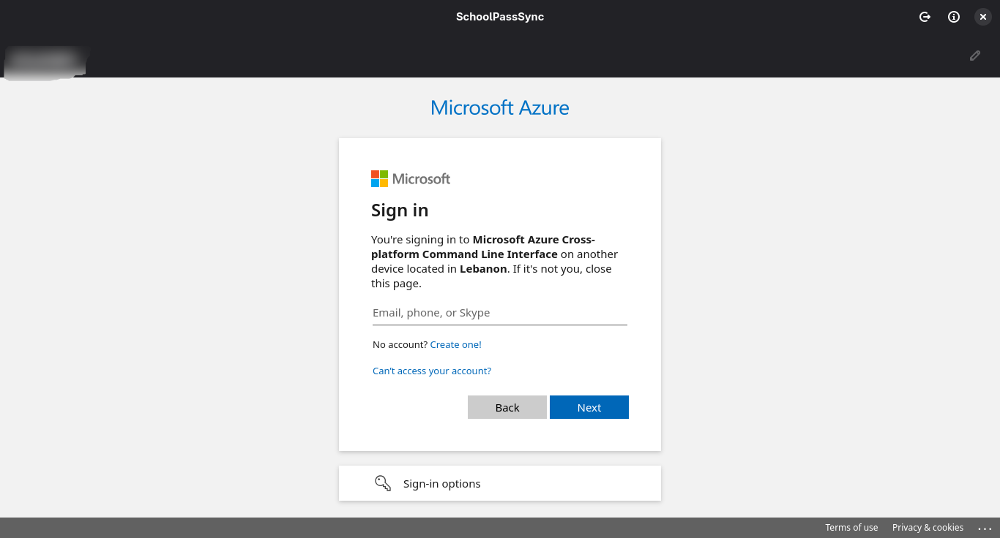
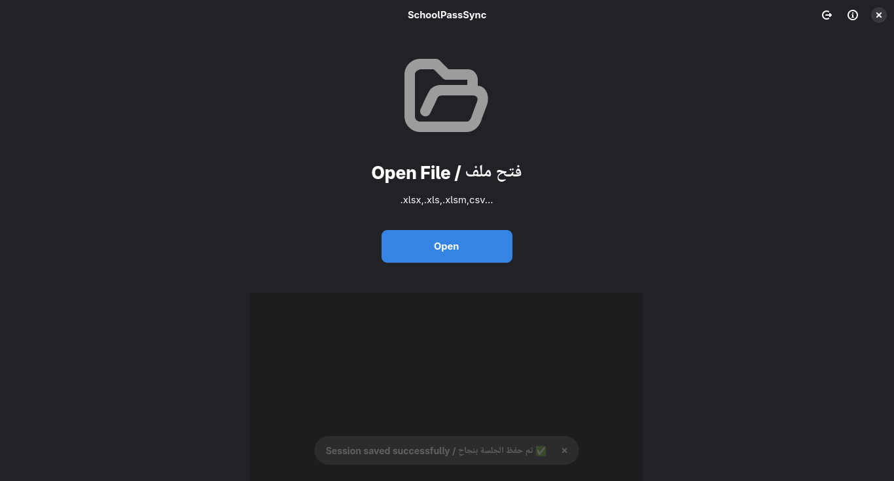
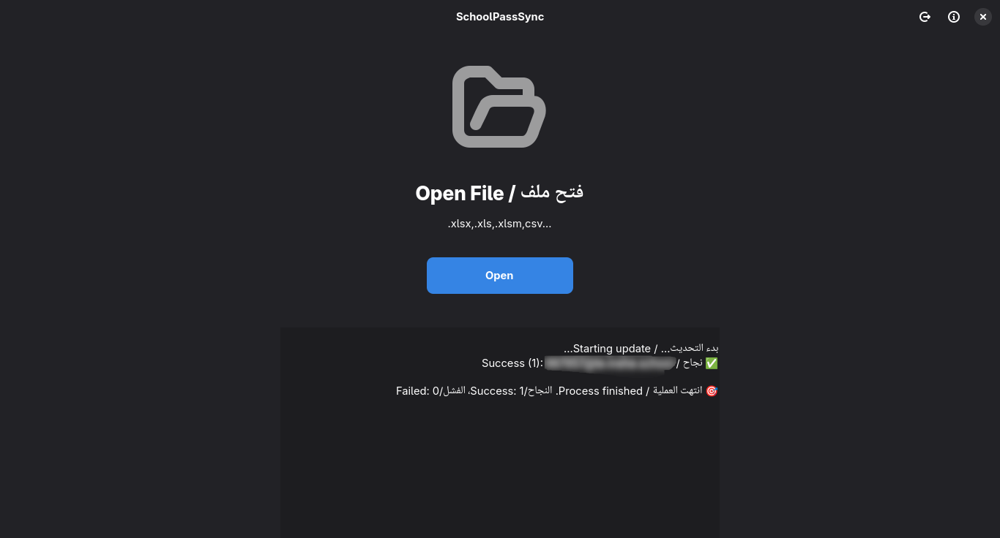
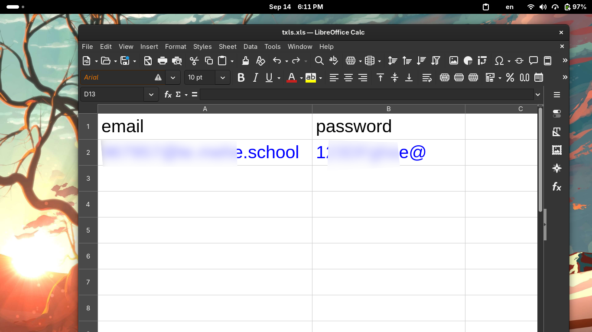

<div align="center">
  <h1>🏫 SchoolPassSync</h1>
  <p>A Cross-Platform Desktop App to Bulk Update Microsoft 365 Passwords</p>
  <p>تطبيق مكتبي لتحديث كلمات مرور حسابات Microsoft 365 دفعة واحدة</p>
</div>

---

##  English

**SchoolPassSync** is a native, cross-platform desktop application designed for school administrators and IT staff to effortlessly perform bulk password resets for Microsoft 365 accounts using the Microsoft Graph API.

### ✨ Features & Architecture
* **Admin Access Required:** You must log in with a Microsoft 365 Administrator account that has password reset privileges.
* **Persistent Session:** Securely saves the `refresh_token` in your operating system's native credential manager (Keyring). You only need to log in once.
* **Final Passwords:** Passwords are updated permanently. The application explicitly disables the "force password change on next login" flag.
* **Platform-Specific Login:** 
  * 🐧 **Linux:** Integrates seamlessly using embedded `WebKitGTK6` for an elegant in-app login experience.
  * 🪟 **Windows:** Securely opens your default external web browser to handle authentication.

### 📄 Data File Requirements
The application extracts data from supported spreadsheet files (Excel/CSV). Your file **MUST** contain the following two columns. **Note: Column headers are strictly case-sensitive.**
* `email`: The full email address of the account.
* `password`: The new password to be applied.

### 📸 Screenshots
**🐧 Linux**





**🪟 Windows**


### 📥 Installation

**🐧 Linux**
**1. Build from Source**
Ensure you have `rust`, `cargo`, `meson`, and the required development headers (`gtk4`, `libadwaita`, `webkitgtk6.0`).

```bash
git clone https://github.com/yucefsourani/schoolpasssync.git
cd schoolpasssync
meson setup build --buildtype=release
meson compile -C build
sudo meson install -C build
```

**2. Fedora Copr**
* Installation via Copr is coming soon!

**🪟 Windows**
* [Download SchoolPassSync for Windows (.exe)](https://github.com/yucefsourani/schoolpasssync/releases/download/v0.1.1/SchoolPassSync-Windows-Setup.exe) *(v0.1.1)*

---

<div dir="rtl">

##  العربية

برنامج **SchoolPassSync** هو تطبيق مكتبي سريع وآمن صُمم خصيصاً لمديري المدارس ومسؤولي الدعم التقني، لتسهيل عملية تحديث كلمات مرور حسابات Microsoft 365 للطلاب والمعلمين دفعة واحدة وبضغطة زر.

### ✨ الميزات وآلية العمل
* **صلاحيات المسؤول:** يتطلب التطبيق تسجيل الدخول أولاً بحساب مسؤول (Admin) يمتلك صلاحيات تغيير كلمات المرور في المؤسسة.
* **حفظ الجلسة (Session Persistence):** يقوم البرنامج بحفظ الـ `refresh_token` بشكل آمن جداً داخل مدير الحماية الخاص بنظام التشغيل (Keyring)، مما يغنيك عن تسجيل الدخول في كل مرة.
* **كلمات مرور نهائية:** عند تحديث كلمة المرور، يتم اعتمادها بشكل نهائي ولا يطلب النظام من المستخدم إعادة تعيينها عند تسجيل دخوله لأول مرة.
* **تجربة مصادقة مخصصة للنظام:**
  * 🐧 **لينكس:** يدمج محرك `WebKitGTK6` ليوفر نافذة تسجيل دخول داخلية سلسة.
  * 🪟 **ويندوز:** يعتمد على فتح المتصفح الخارجي الافتراضي لإتمام تسجيل الدخول بأعلى درجات الأمان.

### 📄 شروط ملفات البيانات
يقوم البرنامج بجلب المعلومات من ملفات الإكسل أو CSV المدعومة. لكي يعمل البرنامج بشكل صحيح، **يجب** أن يحتوي الملف على العامودين التاليين حصراً (مع الانتباه الشديد لحالة الأحرف الصغيرة - Case Sensitive):
* `email`: البريد الإلكتروني للحساب.
* `password`: كلمة المرور الجديدة.

### 📸 صور واجهة البرنامج
**🐧 لينكس**


**🪟 ويندوز**


### 📥 التنزيل والتثبيت

**🐧 لينكس**
**1. البناء والتثبيت من المصدر**
تأكد من توفر بيئة البناء (`rust`, `cargo`, `meson`) ومكتبات التطوير الأساسية (`gtk4`, `libadwaita`, `webkitgtk6.0`).

```bash
git clone https://github.com/yucefsourani/schoolpasssync.git
cd schoolpasssync
meson setup build --buildtype=release
meson compile -C build
sudo meson install -C build
```

**2. مستودع Fedora Copr**
* قريباً! (قيد التحضير)

**🪟 ويندوز**
* [تنزيل البرنامج لنظام ويندوز (.exe)](https://github.com/yucefsourani/schoolpasssync/releases/download/v0.1.1/SchoolPassSync-Windows-Setup.exe) *(v0.1.1)*

</div>
